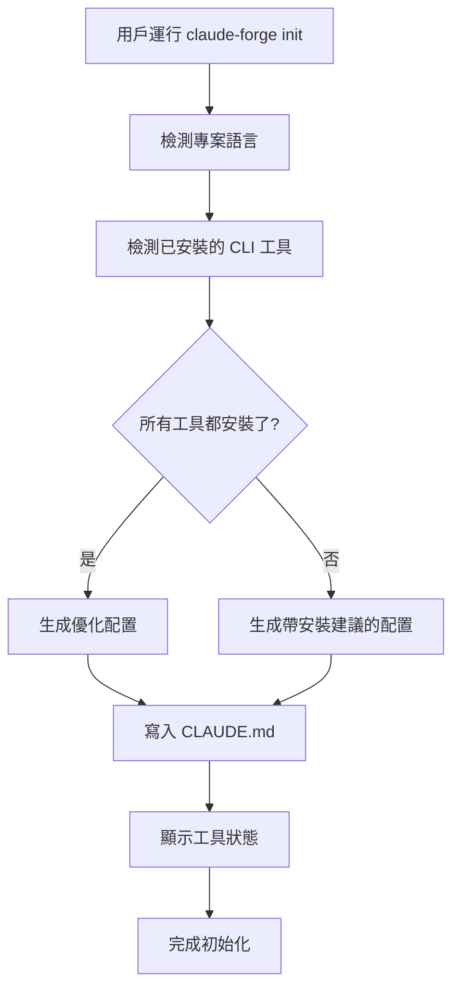

# 智能 CLI 工具檢測功能

## 功能概述

Claude Forge 現在會在生成 CLAUDE.md 時**自動檢測**用戶已安裝的現代 CLI 工具，並根據檢測結果生成**個性化的配置**。

## 工作原理

### 1. 工具檢測

在運行 `claude-forge init` 時，自動檢測以下工具：

- ✅ **ripgrep (rg)** - 快速文本搜索
- ✅ **fd** - 快速文件查找
- ✅ **bat** - 帶語法高亮的文件查看
- ✅ **eza** - 現代化的目錄列表
- ✅ **dust** - 磁盤使用分析

### 2. 條件化內容生成

根據檢測結果，生成三種不同的內容：

#### 場景 A: 工具已安裝 ✅

```markdown
**Directory Listing:**
- ✅ ALWAYS: `eza -la --icons --git`
- ❌ NEVER: `ls -la` or `ls`
```

#### 場景 B: 工具未安裝 ℹ️

```markdown
**Directory Listing:**
- ℹ️ Consider installing `eza` for better directory listing: `brew install eza`
- Current: Use `ls -la` (basic)
```

#### 場景 C: 提供安裝建議 📦

如果有工具未安裝，會在配置文件中添加：

```markdown
### 📦 Recommended Tools to Install

Run this command to install missing tools:
```bash
claude-forge tools install
```

Or install individually:
```bash
# Fast text search
brew install ripgrep  # or: cargo install ripgrep

# Fast file finder
brew install fd  # or: cargo install fd-find
```
```

## 使用示例

### 示例 1: 全新環境（沒有安裝工具）

```bash
$ claude-forge init --lang rust

🚀 Initializing Claude Code configuration...
✓ Detected language: Rust
⚠️ No modern CLI tools detected (0/5)
✓ Configuration generated with installation suggestions
```

生成的 CLAUDE.md 包含：
```markdown
<!-- ⚠️ No modern CLI tools installed (0/5). Run `claude-forge tools install` -->

# Rust Project Memory

...

## 🚫 CLI Tool Usage (When Using Bash)

**Directory Listing:**
- ℹ️ Consider installing `eza`: `brew install eza`
- Current: Use `ls -la` (basic)

**Text Search:**
- ℹ️ Consider installing `ripgrep`: `brew install ripgrep`
- Current: Use `grep pattern` (basic)

### 📦 Recommended Tools to Install
...
```

### 示例 2: 部分工具已安裝

```bash
$ brew install ripgrep fd bat
$ claude-forge init --lang typescript

🚀 Initializing Claude Code configuration...
✓ Detected language: TypeScript
ℹ️ 3/5 modern CLI tools installed
✓ Configuration generated
```

生成的 CLAUDE.md 包含：
```markdown
<!-- ℹ️ 3/5 modern CLI tools installed. Run `claude-forge tools check` to see details -->

# TypeScript Project Memory

...

## 🚫 CLI Tool Usage (When Using Bash)

**Text Search (if not using Grep tool):**
- ✅ ALWAYS: `rg pattern`
- ❌ NEVER: `grep pattern`

**File Search (if not using Glob tool):**
- ✅ ALWAYS: `fd pattern`
- ❌ NEVER: `find . -name pattern`

**File Viewing (for display purposes):**
- ✅ ALWAYS: `bat filename`
- ❌ NEVER: `cat filename`

**Directory Listing:**
- ℹ️ Consider installing `eza`: `brew install eza`
- Current: Use `ls -la` (basic)

**Disk Usage:**
- ℹ️ Consider installing `dust`: `brew install dust`
- Current: Use `du -sh` (basic)

### 📦 Recommended Tools to Install
eza, dust
```

### 示例 3: 所有工具已安裝

```bash
$ claude-forge tools install  # 安裝所有工具
$ claude-forge init --lang python

🚀 Initializing Claude Code configuration...
✓ Detected language: Python
✅ All modern CLI tools installed (5/5)
✓ Configuration generated
```

生成的 CLAUDE.md 包含：
```markdown
<!-- ✅ All modern CLI tools installed (5/5) -->

# Python Project Memory

...

## 🚫 CLI Tool Usage (When Using Bash)

**Directory Listing:**
- ✅ ALWAYS: `eza -la --icons --git`
- ❌ NEVER: `ls -la` or `ls`

**Disk Usage:**
- ✅ ALWAYS: `dust -d 2`
- ❌ NEVER: `du -sh` or `du`

**File Viewing (for display purposes):**
- ✅ ALWAYS: `bat filename`
- ❌ NEVER: `cat filename`

**File Search (if not using Glob tool):**
- ✅ ALWAYS: `fd pattern`
- ❌ NEVER: `find . -name pattern`

**Text Search (if not using Grep tool):**
- ✅ ALWAYS: `rg pattern`
- ❌ NEVER: `grep pattern`
```

## 技術實現

### 核心代碼

```rust
// src/core/tools_detector.rs
pub struct ToolsDetector {
    checker: ToolsChecker,
}

impl ToolsDetector {
    pub fn detect(&self) -> Result<InstalledTools> {
        // 檢測每個工具是否安裝
        let results = self.checker.check_all()?;

        Ok(InstalledTools {
            ripgrep: *results.get("rg").unwrap_or(&false),
            fd: *results.get("fd").unwrap_or(&false),
            bat: *results.get("bat").unwrap_or(&false),
            eza: *results.get("eza").unwrap_or(&false),
            dust: *results.get("dust").unwrap_or(&false),
        })
    }

    pub fn generate_tools_section(&self, tools: &InstalledTools) -> String {
        // 根據安裝狀態生成相應的配置文本
        // ...
    }
}
```

### 集成到生成器

```rust
// src/core/generator.rs
fn generate_claude_md(&self, claude_dir: &Path) -> Result<()> {
    let mut content = self.registry.get_language_claude_md(self.language)?;

    // 智能檢測並替換工具配置部分
    let tools_detector = ToolsDetector::new();
    if let Ok(installed_tools) = tools_detector.detect() {
        let tools_section = tools_detector.generate_tools_section(&installed_tools);

        // 替換或添加工具配置
        // ...
    }

    write_file(&file_path, &content)?;
    Ok(())
}
```

## 優勢

### 1. 個性化體驗
- ✅ 根據用戶環境生成適合的配置
- ✅ 避免推薦已安裝的工具
- ✅ 提供具體的安裝指令

### 2. 漸進式增強
- ✅ 沒有工具也能用（提供基礎命令）
- ✅ 安裝工具後自動優化
- ✅ 不強制要求用戶安裝

### 3. 教育性
- ✅ 告訴用戶有哪些更好的工具
- ✅ 提供安裝方法
- ✅ 解釋為什麼要用這些工具

## 工作流程



## 未來增強

### 1. 平台特定建議
```rust
// 根據操作系統提供不同的安裝命令
match platform {
    Platform::MacOS => "brew install ripgrep",
    Platform::Linux => "sudo apt install ripgrep",
    Platform::Windows => "scoop install ripgrep",
}
```

### 2. 版本檢測
```rust
// 檢測工具版本並建議升級
if version < minimum_version {
    suggest_upgrade();
}
```

### 3. 互動式安裝
```rust
// 在 init 時詢問是否要安裝缺失的工具
if missing_tools.len() > 0 {
    if confirm("Install missing tools now?") {
        install_tools(&missing_tools).await?;
    }
}
```

## 測試

```bash
# 測試不同場景
cargo test tools_detector

# 測試生成的配置
./target/release/claude-forge init --lang rust
cat .claude/CLAUDE.md | grep "CLI Tool"
```

## 效果對比

### 之前：靜態模板
- 所有用戶得到相同的配置
- 可能推薦已安裝的工具
- 沒有個性化建議

### 現在：智能檢測
- ✅ 每個用戶得到定制化配置
- ✅ 只建議未安裝的工具
- ✅ 提供具體安裝步驟
- ✅ 顯示當前工具狀態

---

**這個功能讓 Claude Forge 變得更智能、更實用！** 🎉
